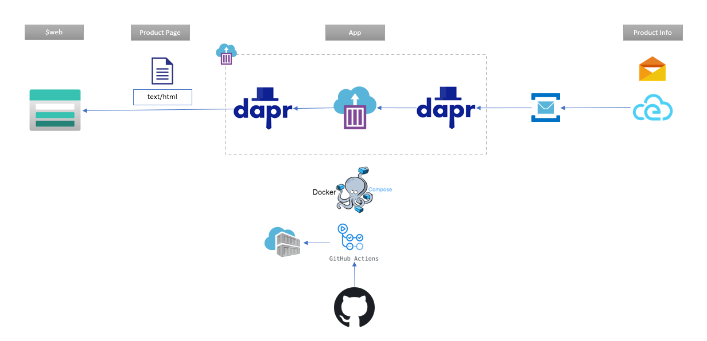
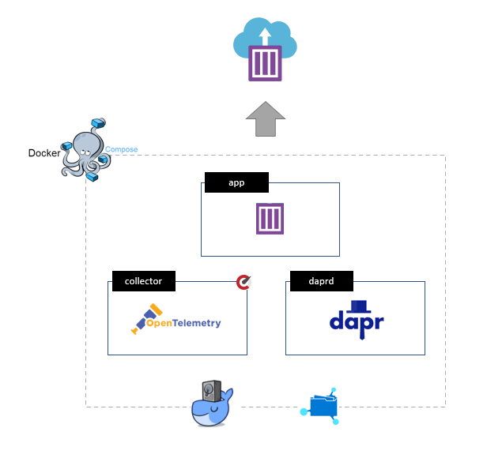

# Dapr.WebPush

<!--  -->

This is a demo of a flow pushing a product web page/fragment to a static site, when product information changes, using dapr pub/sub and bindings.

### Flow



- Receive "product" updates (pub/sub or input binding)
- Execute templating
- Push to static web (output binding)

#### TODO
- Cache state
- Push all on changed template


## Guide

To recreate this project, follow this steps with the corresponding files and snippets as guide.

### Azure

Following services are needed.

- Container instances
- Container registry
- Service Bus
- Storage (file share + static web)
- Application insights

### Docker and Compose

Files for full details;

- [docker file](./src/csharppush/Dockerfile)
- [compose file](./docker-compose.yml)

Dapr components used;

- [Pub/Sub Azure Service Bus](https://docs.dapr.io/operations/components/setup-pubsub/supported-pubsub/setup-azure-servicebus/)
- [Output binding for Azure Blob Storage](https://docs.dapr.io/operations/components/setup-bindings/supported-bindings/blobstorage/)

Steps;

- Create an app with a [docker file](./src/csharppush/Dockerfile).
- Add a [compose file](./docker-compose.yml) to your solution
- Add daprd to compose
- Add the shared volume to the compose file
- Upload the dapr components and config file to the file share (components folder)
- Set the starting command for daprd to correspond with the file share
- Add the telemetry collector to compose
- Create a folder and upload configuration for "otel" collector
- Configure volume in compose for the collector

### Github Action

Follow along with the [workflow file](./workflows/docker-acr.yml).

This workflow utilize secrets outlined in [resources](#resources)

- Checkout
- Install compose CLI
- Login to Azure
- Login to Container Registry
- Build container
- Push container to Registry
- Login docker to Azure for context
- Create an ACI context
- Use Compose to push group to ACI


### Product Data

```powershell
 dapr publish --pubsub azurepubsub -t in -d '{\"Title\": \"Fancy Table\", \"Price\": 2500, \"Id\": 4}'
```
Using the dapr CLI we'll post this payload. This could be modified and sent via service bus explorer.

```json
 {"id":"69136027-cb55-47cd-9b32-cdf27b3059f8","source":"push","type":"com.dapr.event.sent","specversion":"1.0","datacontenttype":"application/json","data":{"Title":"Fancy Table","Price":2500,"Id":4},"subject":"00-2c3a831ad26182bf444b131b84945393-792c2bb284a9f319-01","topic":"in","pubsubname":"azurepubsub"}
```

### Application insights

```yaml
apiVersion: dapr.io/v1alpha1
kind: Component
metadata:
  name: native
  namespace: default
spec:
  type: exporters.native
  metadata:
  - name: enabled
    value: "true"
  - name: agentEndpoint
    value: "0.0.0.0:55678"
```

```bash
dapr run {.....} --config config/otel.config 
```

```yaml
apiVersion: dapr.io/v1alpha1
kind: Configuration
metadata:
  name: appconfig
  namespace: default
spec:
  tracing:
    samplingRate: "1"
```

#### Open Telemetry


```yaml
receivers:
  opencensus:
      endpoint: 0.0.0.0:55678
exporters:
  azuremonitor:
  azuremonitor/2:
    endpoint: "https://dc.services.visualstudio.com/v2/track"
    instrumentation_key: "<KEY>"
    maxbatchsize: 100
    maxbatchinterval: 10s
service:
  pipelines:
    traces:
      receivers: [opencensus]
      exporters: [azuremonitor/2]
```

### Deployment

- Building an image
- Push it to a Azure Conatiner Registry
- Deploy it with Dapr through docker compose to ACI
- Using a Azure File share for component config



#### TODO
- Key vault secrets

### Resources

- [Configure a GitHub action to create a container instance](https://docs.microsoft.com/en-us/azure/container-instances/container-instances-github-action)
- [Setting Up Cloud Deployments Using Docker, Azure and Github Actions](https://www.docker.com/blog/setting-up-cloud-deployments-using-docker-azure-and-github-actions/)
- [Dapr Sample - Hello docker compose](https://github.com/dapr/samples/tree/master/hello-docker-compose)
- [Dapr demos](https://github.com/mchmarny/dapr-demos)
